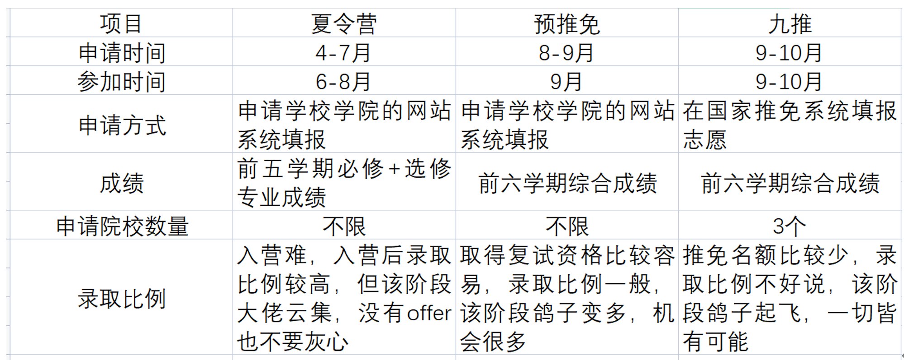
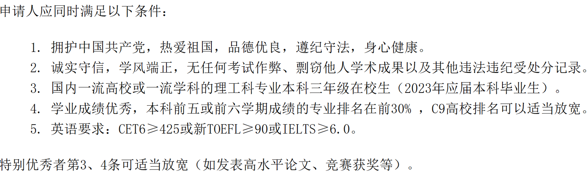

# 个人情况介绍：
1. 排名：夏令营时期 2th，GPA：3.92/4；预推免时期排名 3th，GPA：3.92/4。
2. 奖项：① 国家级大创；② 数学竞赛省一；③ “海信杯”省一；④ 英语竞赛省三。
3. 英语：四级580分，六级554分。 
注：本人仅参与了暑期夏令营，并未参与预推免和九推；

# 常见问题：
## 夏令营、预推免和九推有什么区别？

## 夏令营、预推免的推免成绩是如何计算的？
夏令营时期成绩排名为前五学期必修和选修课程成绩，选修课成绩也尽量卷到优秀；预推免时期成绩为前六学期必修课程成绩，决定是否具有推免资格。

## 申请夏令营有什么条件，需要什么材料呀？
以下以2022年上交自动化夏令营公告为例：

## 保研只有绩点，没有什么科研项目可以吗？
高绩点是比较好的院校夏令营的敲门砖，像自所、上交、清华、北理夏令营都只招前几名；但进入夏令营后就靠自己发挥了，成绩就不好使了，得好好准备专业课，缕一缕项目经历，如果实在没什么科研项目，可以写一下在校期间的一些实验和课设什么的，这些都是我们亲身经历的，问起来其实更能轻松应对一点，那些看起来比较“高大上“的项目如果没有怎么参与过是很容易露馅的，大家一定要对自己简历里写的项目负责，自圆其说，可以问一下哪些参与度比较高的同学技术难点和项目细节什么的。

## 大概什么时候联系导师啊？
大部分院校都是支持越早联系越好，但不同院校的模式都是不一样的，例如华科尽量早点联系，4、5月份就可以联系了，而自所就是拿到优营后有个双选会，在这之前老师都只会礼貌回答。如果夏令营结束后还没拿到理想的offer，一定要尽快联系导师，预推免环节中导师的作用很大。

## 夏令营时间点
以下是2022年部分院校夏令营报名时间点，可以作为参考，大家对于感兴趣的院校一定要时常浏览其院系招生公告，避免错过报名时间点，也可以做个表格提醒自己及时填报系统，尽量不要踩着deadline报名，防止填报内容有误。
 
# 夏令营
## 夏令营报名情况
1. 报名:中科院自动化所，清华深圳信工，上交自动化直硕，华科自动化，北理自动化，西交自动化，北航自动化。
2. 入营:中科院自动化所，上海交通大学直硕，华中科技大学，北京理工大学，西安交通大学，北京航空航天大学。
3. offer:中科院自所专硕/直博，上海交大专硕，北航优营。
4. 去向：中科院自所专硕。

## 面试情况：
### 西安交通大学
- 流程：预定面试15min，2min英文自我介绍+13min提问。
- 实际：面试时长很短，在英语自我介绍之后面试官问了一些他们比较感兴趣的项目细节，我当时就被问到了“海信杯“中的视觉模块为什么选择了单目而非双目，单目的具体原理和实现方法是什么？我简单答了之后面试就结束了，全长6min。
- 总结：老师们态度都很好，都很温柔，问的问题应该是众多夏令营中最轻松的了，不用过于紧张，因为西交是我参加的第一个夏令营（最早），面试的时候就有些结巴了，面试结果也不是很理想，大家一定要放平心态，就当唠嗑就行^_^。

### 北京理工大学
- 流程：面试20min，需要准备PPT，3min的中文自我介绍，然后是5min的英语提问，之后就是自由提问环节。
- 实际：自由提问环节问了现控问题，PID的具体实现方式，在实际应用中是如何调参数的，项目中也对“海信杯“人工智能比赛中的深度学习单目视觉自动避障项目感兴趣，问了为什么单目视觉缺少了深度信息，还问了大创项目中的人机交互环节是怎么实现的，面试完当天会给出优营名单。
- 总结：老师们都比较严格，对专业基础知识比较看重，问题会比较深，很难转移到自己比较会的问题上，大家在简历上写的东西一定要反问自己一些工程细节，比较水的项目也最好了解相关的知识；北理的夏令营可以说是严进严出，最终只给了30个offer，我们这届只有前三入营面试。

### 华中科技大学
华科只有讲座，没有组织大型面试环节，而且优秀营员不意味着有offer，华科是导师制的，讲座结束后可以自行联系感兴趣的导师，导师的权力是比较大的，有了优秀营员后还是要参加预推免和九推。

### 上海交通大学
- 实际：先笔试，考c++、线性代数和自控，大家要好好复习c++知识，题目不难但得会#_#，再双机位面试，准备PPT自我介绍，有一个专门负责英语面试的，会用英语问项目的细节和重难点，这个英语回答一定要预先措辞，临场发挥很容易露馅，中文面试环节关于你的ppt描写的项目逐一提问，轮番拷打，问的特别细节，有具体技术环节会遇到的一些问题，要是没有实际做过挺难回答的。
- 总结：上交没有拉群，全程笔试、面试通知都是通过邮件的，保密性很强，双机位面试，可以预先买个三脚架，仪器续航能力得强，只有在面试当天才知道面试顺序和组别。大家要是想去上交学硕的话，得好好准备一下编程，我当时是考了c++，但我上届学姐没有考编程题，所以上交的笔试真的只有当天才能知道了。。。我最后是有了上交专硕的offer，可能是其他大佬鸽的有点多。

### 中科院自动化所
- 自所的讲座真的非常非常吸引人！每个分享的老师都对科研抱有极大热情，很多大牛分享了自己的项目，也有上一届的师兄师姐阐述了选择自所的理由。自所在人工智能领域是全国顶尖的，也是唯一一个在讲座分享期间就激起我高昂的科研热情，还没开始面试的时候我就非常非常想进自所读研。
- 面试内容
  - 先进行2min的中文自我介绍，英语提问：问了我的家乡和兴趣爱好， 
  - 数学提问(自所经典考察环节)：极值和零点存在定理，自所非常看重数学，大家好好看看，问题很随机，大家可以看看知乎的一些经验分享贴。
  - 自由提问环节：问了我写的特别小的一个项目，说是可以说明一下mindspore框架是什么吗（之前的一个华为基座），还问了我控制中通常有几个闭环，说一下优劣势，还问了深度学习的一些算法。
  - 最后开始了闲唠嗑环节，问了为什么我的特长是幽默（之前填系统的内容），还问了我愿意来自所读博士吗？家里人会有什么意见吗？
- 总结：我面自所的时候已经是后期了，被其他学校磨得没有棱角了，面试的时候也是当作一次交流的机会，可能是心态变了，一点也不紧张，这也是我面的最好的一次了，大家一定要稳如老狗，就当唠闲嗑；数学最好都复习一遍，微积分，线代，复变都看看。

### 北京航空航天大学
- 实际：笔试+面试，笔试内容有微积分、线代、概率论、自控、现控，全英语试题，开卷，要求英文书写答案，考得比较全面，难度不是很大。笔试之后筛掉一些人之后开展面试。
- 面试内容全方位多层次宽领域!_! 北航的老师问的很全面，拷打了我一遍专业问题。。。问了微积分、线代、概率论、单片机、微机、自控、现控、模电和数电，具体问题记不太清了，数学揪着我问了很久，还问了单片机和微机的区别，mosfet和三极管的应用区别。英语问了我pid的英文是什么？还有的问了项目细节。
- 总结：北航非常适合基础扎实的同学，从笔试再到面试，专业问题很多。最后我是拿到了北航的优秀营员，可能是面试的问题刚巧会的比较多，但拿到优营后还是要参加预推免的，会优先录取。（注意：优营还要参加预推免）
